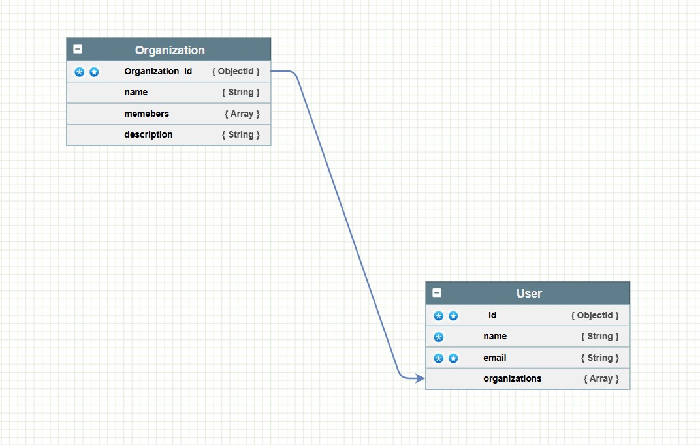

# Organization and User Management API

A RESTful API for managing organizations and users, including user roles within organizations.

## Features

- **User Management**: Register and authenticate users.
- **Organization Management**: Create, update, and delete organizations.

## Tech Stack

- **Node.js**: JavaScript runtime for building server-side applications.
- **Express**: Web framework for Node.js for building APIs.
- **MongoDB**: NoSQL database for storing user and organization data.
- **Mongoose**: ODM library for MongoDB and Node.js.
- **JWT**: For secure authentication and authorization.
- **Postman**: For API testing.

## Getting Started

### Prerequisites

- **Node.js**: Version 14 or higher
- **MongoDB**: Local installation 

### Installation

1. Clone the repository:
   ```bash
   git clone https://github.com/Amir380-A/Task

## Installation

### Navigate into the project directory:
```bash
cd Task
npm install
```
### Navigate into the project directo:
#### install Docker and run the services specified in docker-compose file and make sure to make your own secret keys and configs in a .ENV file and 
```bash
docker-compose up
```
to fireup both redis and mongodb and connect your app with them.
## Schema 


